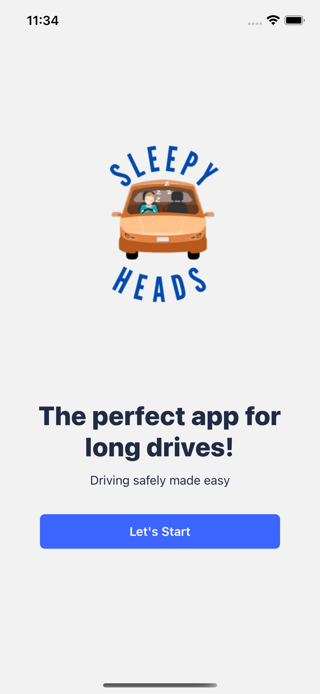
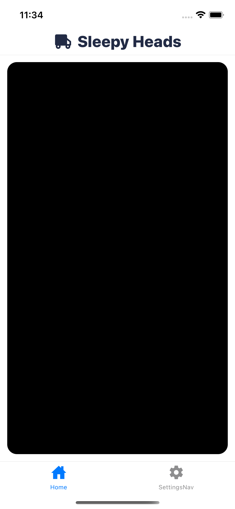
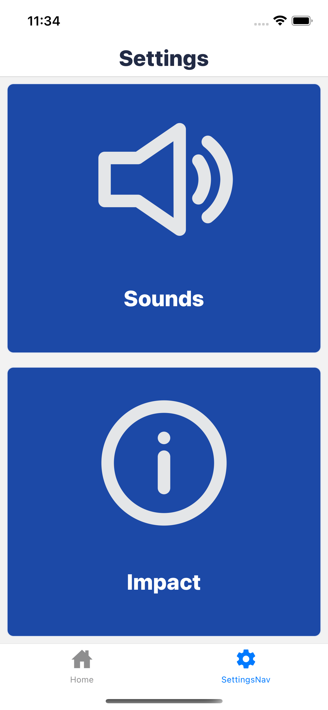

# SleepyHeads 2.0

 </img>

## Inspiration + What it does

Each year there are an estimated 100,000 crashes related to drowsy driving which result in 800 fatalities and about 50,000 injuries. The issue of drowsy driving is even more prevalent in the truck driving industry. The American Trucking Association finds that almost one-third of commercial truck drivers have mild to severe sleep apnea making them 2.5 times as likely to be in an accident with another motor vehicle. We wanted to make an impact with our project and help solve this problem, thereby making roads safer for all drivers. To do this, we created SleepyHeads, an app that uses machine learning to determine the state of a driver's eye and alert them if they are dosing off.

## How we built it

Our app, SleepyHeads, uses machine learning to detect the state of a driver's eyes: open or close. We used a camera module to track the user's face. We run a constant stream of the user's face every 100ms and send it to a machine learning model which gives us a probability of whether the driver's eyes are open or close. If the probability is greater than 75% we play a sound, selected by the user, to alert them.

## Challenges we ran into

One challenge we ran into was detecting whether the user was blinking or their eyes were actually closed (when the driver is drowsy). To fix this we implemented a counter system in which we add 1 to the counter for every frame the user's eyes are closed and reset the counter back to 0 when they are open. If the counter exceeds the value of 5 (translating to 500ms) we determine the driver's eyes are closed and start the alert process.

## Accomplishments that we're proud of

We are proud that we were able to create a working app in such a short time. We were able to put all our interests together to create an impactful project to help solve the challenge of drowsy driving.

## What we learned

1) How to work with the React Native framework
2) Implementing Expo CLI React Native
3) Convolutional Neural Networks
4) Using TailwindsCSS
5) How to use Figma for app design

## What's next for SleepyHeads

Our next steps are to get certified Apple licensing and Android licensing to publish our app to the app store and play store. We will then market the app on a variety of social media platforms and reach out to potential sponsors to help grow our business and range.

## Demo

[](https://youtu.be/hbChkxDGbnU)

## Screenshots

<table>
  <tr>
     <td>Splash Screen</td>
     <td>Home Screen</td>
     <td>Settings Page</td>
  </tr>
  <tr>
    <td></td>
    <td></td>
    <td></td>
  </tr>
 </table>

## Run Locally

Clone the project

```bash
  git clone https://github.com/krash3125/SleepyHeads.git
```

Go to the project directory

```bash
  cd SleepyHeads
```

Install dependencies

```bash
  npm install
```

Start the expo server

```bash
  expo start
```
