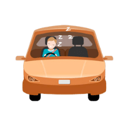
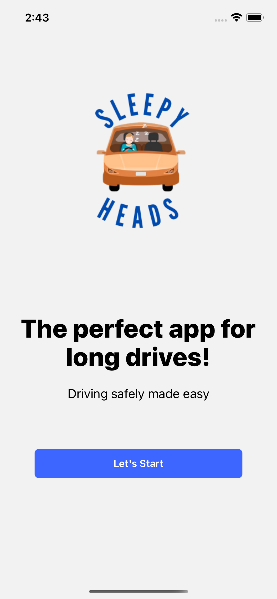
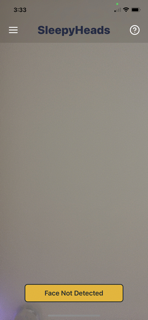
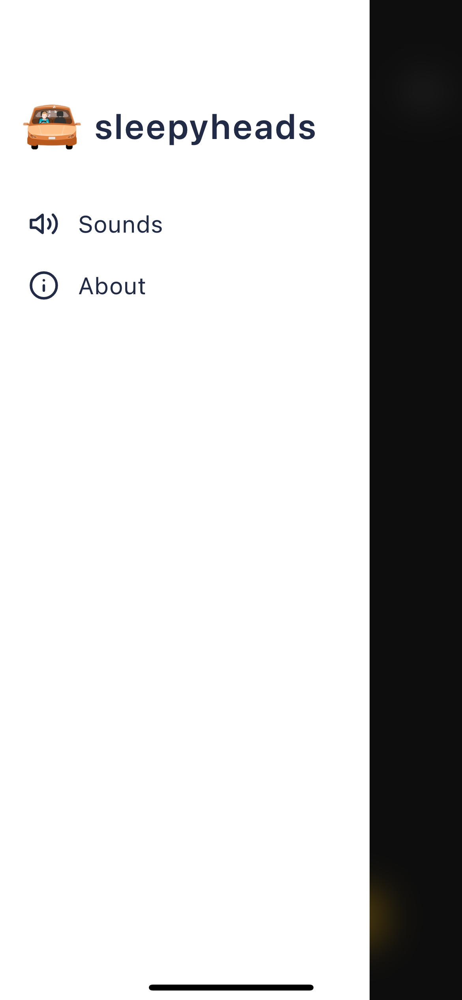
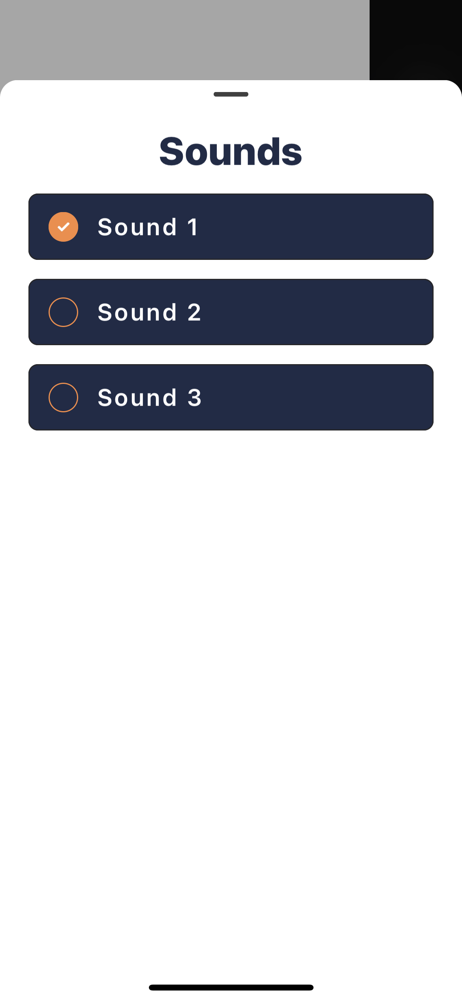
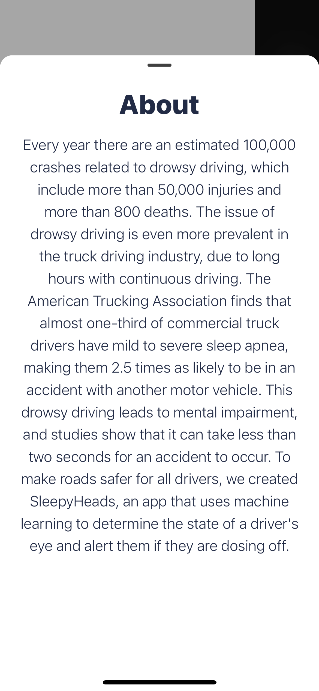
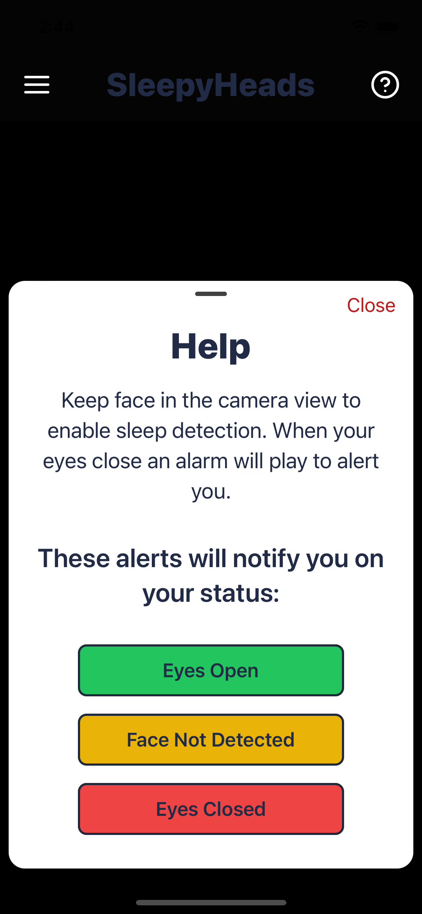

# SleepyHeads 2.0

 </img>

## Inspiration + What it does

Every year there are an estimated 100,000 crashes related to drowsy driving, which include more than 50,000 injuries and more than 800 deaths. The issue of drowsy driving is even more prevalent in the truck driving industry, due to long hours with continuous driving. The American Trucking Association finds that almost one-third of commercial truck drivers have mild to severe sleep apnea, making them 2.5 times as likely to be in an accident with another motor vehicle. This drowsy driving leads to mental impairment, and studies show that it can take less than two seconds for an accident to occur. To make roads safer for all drivers, we created SleepyHeads, an app that uses machine learning to determine the state of a driver's eye and alert them if they are dosing off. 

## How we built it

SleepyHeads uses machine learning to detect the state of a driver's eyes: open or closed. We used a camera module to track the user's face. We ran a constant stream of the user's face every 100ms and sent it to a machine learning model, giving us a probability of the state of the user's eyes. If the probability is greater than 75%, we play a customizable sound to alert them. We used react-native-gesture-handler and react-native-reanimated to make smooth transition and allow for the app to have a native feel.

## Challenges we ran into

One challenge we ran into was detecting whether the user was blinking or whether they were actually drowsy or sleeping. To fix this, we implemented a counter system in which we add 1 to the counter for every frame the user's eyes are closed and reset the counter back to 0 when they are open. If the counter exceeds the value of 5 (translating to 500ms), we determine the driver's eyes are closed and start the alert process. It was hard to think of a new app design and implement it. The design we chose was a bit harder to do but TailwindCSS helped simplify the process.

## Accomplishments that we're proud of

We are proud that we were able to make a meaningful app that has a positive real-world impact and solves a common problem. This app was designed to fix an issue that causes hundreds of thousands of crashes, and we are proud that we were able to think of a solution to help all these people. We were also able to accomplish this in such a short amount of time and overcome any challenges that we encountered along the way.

## What we learned

1) React Native with Expo
2) TailwindCSS Advanced Implementation
3) React-Native-Gesture-Handler + React-Native-Reanimated
4) Bottom Sheet Navigation
5) Used Figma for App Redesign

## What's next for SleepyHeads

Our next steps are to get certified Apple licensing and Android licensing to publish our app to the app store and play store. We will then market the app on a variety of social media platforms and reach out to potential sponsors to help grow our business and range. We have already had the CEO of Waze systems reach out to us, and we hope to demo this application to them for the integration of our idea into their pre-existing software and save thousands of lives by doing so.
## Demo

[](https://youtu.be/hbChkxDGbnU)

## Screenshots

<table>
  <tr>
     <td>Splash Screen</td>
     <td>Home Screen</td>
     <td>Drawer Page</td>
     <td>Sounds Page</td>
     <td>About Page</td>
     <td>Help Page</td>
  </tr>
  <tr>
    <td></td>
    <td></td>
    <td></td>
    <td></td>
    <td></td>
    <td></td>
  </tr>
 </table>

## Run Locally

Clone the project

```bash
  git clone https://github.com/krash3125/SleepyHeads.git
```

Go to the project directory

```bash
  cd SleepyHeads
```

Install dependencies

```bash
  npm install
```

Start the expo server

```bash
  expo start
```
